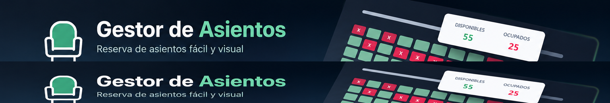
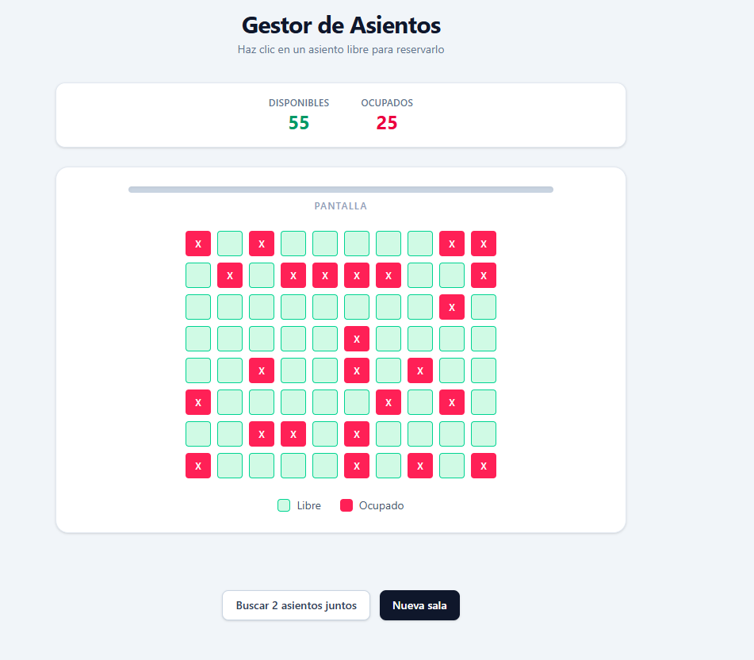
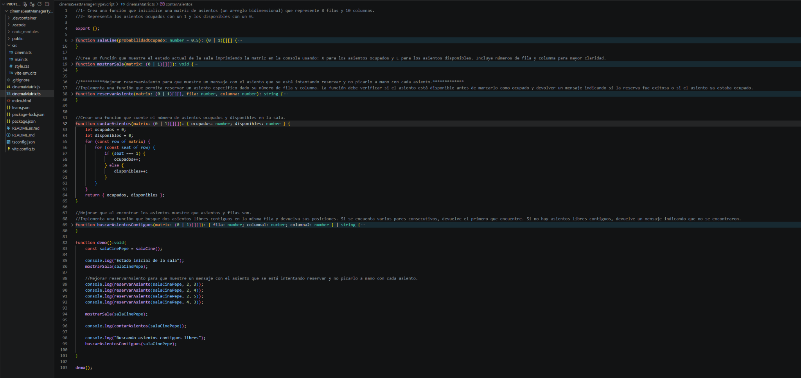

# 🎬 Gestor de Asientos

<p align="center">
  
</p>

<p align="center">
  <strong>Aplicación web para visualizar, consultar y reservar asientos de una sala de cine de forma sencilla e intuitiva.</strong>
</p>

<p align="center">
  
  
  
  
</p>

---

## 📌 Sobre el proyecto

**Gestor de Asientos** es un proyecto práctico centrado en la gestión visual de los asientos de una sala.

La aplicación representa una sala con **8 filas y 10 columnas**, donde cada asiento puede estar disponible u ocupado. El usuario puede consultar el estado de la sala, reservar asientos libres y buscar posiciones consecutivas.

El proyecto transforma una lógica basada en matrices en una interfaz web visual e interactiva.

---

## ✨ Funcionalidades

- 🎟️ Representación visual de una sala de **8 × 10 asientos**.
- 🟢 Identificación de asientos disponibles.
- 🔴 Identificación de asientos ocupados.
- 🖱️ Reserva de asientos indicando fila y columna.
- 📊 Contador de asientos disponibles y ocupados.
- 🔎 Búsqueda de asientos libres consecutivos.
- 🔄 Generación de nuevas salas con una distribución diferente.
- 💻 Interfaz limpia y sencilla.

---

## 🧠 Lógica principal

El estado de la sala se representa mediante una matriz bidimensional:

```ts
type Asiento = 0 | 1;
type Sala = Asiento[][];

// 0 → disponible
// 1 → ocupado
```

### `salaCine()`

Genera la matriz inicial de asientos y determina aleatoriamente qué posiciones están ocupadas.

### `mostrarSala()`

Recorre la matriz y muestra el estado de cada asiento, facilitando también la depuración desde la consola.

### `reservarAsiento()`

Recibe una fila y una columna, comprueba si el asiento está disponible y, si lo está, lo marca como ocupado.

### `contarAsientos()`

Recorre la matriz para obtener el número de asientos disponibles y ocupados.

### `buscarAsientosContiguos()`

Analiza las filas de la sala para localizar asientos libres consecutivos y devolver sus posiciones.

---

## 🖥️ Capturas

### Aplicación

<p align="center">
  
</p>

### Implementación

<p align="center">
  
</p>

---

## 🛠️ Tecnologías

| Tecnología | Uso |
|---|---|
| **TypeScript** | Lógica y gestión de la matriz de asientos |
| **Vite** | Entorno de desarrollo y build |
| **HTML5** | Estructura de la interfaz |
| **CSS3** | Diseño y estilos visuales |
| **JavaScript / DOM** | Interacción con la interfaz |

---

## 🚀 Instalación y ejecución

### 1. Clonar el repositorio

```bash
git clone https://github.com/TU-USUARIO/gestor-asientos.git
```

### 2. Entrar en el proyecto

```bash
cd gestor-asientos
```

### 3. Instalar dependencias

```bash
npm install
```

### 4. Iniciar el servidor de desarrollo

```bash
npm run dev
```

Vite mostrará en la terminal la dirección local de la aplicación, normalmente:

```text
http://localhost:5173
```

---

## 📁 Estructura del proyecto

```text
gestor-asientos/
├── assets/
│   ├── banner.png
│   ├── aplicacion.png
│   └── codigo.png
├── public/
├── src/
│   ├── cinemaMatrix.ts
│   ├── main.ts
│   └── style.css
├── index.html
├── package.json
├── tsconfig.json
├── vite.config.ts
└── README.md
```

---

## 🎯 Objetivo de aprendizaje

Este proyecto permite practicar conceptos fundamentales de programación y desarrollo frontend:

- Arrays y matrices bidimensionales.
- Tipado con TypeScript.
- Funciones y parámetros.
- Bucles y recorridos de estructuras.
- Condicionales.
- Gestión del estado de una aplicación.
- Manipulación del DOM.
- Separación entre lógica y presentación.
- Desarrollo con Vite.

---

## 📈 Posibles mejoras

- Persistencia de reservas mediante `localStorage`.
- Selección de asientos directamente desde la interfaz.
- Confirmación de reserva.
- Diferentes precios según la ubicación.
- Gestión de varias salas.
- API y base de datos.
- Sistema de usuarios.
- Animaciones y feedback visual.

---

## 👨‍💻 Autor

Proyecto desarrollado como práctica de programación y desarrollo web, aplicando TypeScript a un caso de uso realista de gestión de asientos.

---

<p align="center">
  <sub>Gestor de Asientos · TypeScript + Vite</sub>
</p>
